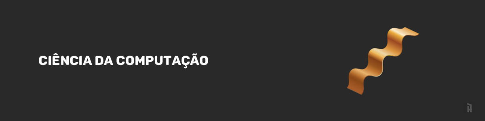

# Conteúdo para estudo de Ciência da Computação

O objetivo deste repositório é reunir conteúdo para que eu e você possamos consultar durante estudos em Ciência da Computação. Irei separar em sessões de:

  <a href="#rocket-sobre-o-desafio">🎓 Cursos</a>
  &nbsp;&nbsp;&nbsp;|&nbsp;&nbsp;&nbsp;
  <a href="#livros">📚 Livros</a>
  &nbsp;&nbsp;&nbsp;|&nbsp;&nbsp;&nbsp;
  <a href="#artigos-e-sites">📝Artigos e sites</a>  

Neste mesmo repositório existem alguns itens "extras" que dependendo da sua curiosidade podem ser úteis, eu os separo como resumos e anotações. Onde apenas faço anotações livremente enquanto assisto ou leio algo.

  <a href="/resumes">Resumos de livros</a>
  &nbsp;&nbsp;&nbsp;|&nbsp;&nbsp;&nbsp;
  <a href="/akita-videos">Anotações de vídeos</a>
  &nbsp;&nbsp;&nbsp;|&nbsp;&nbsp;&nbsp;
  <a href="/cs50">Anotações do CS50</a>

Enquanto eu estudava encontrei um repositório muito legal do @jwasham que tem a mesma ideia desse aqui, tudo que agrega é ótimo, se quiser dar uma olhada no [Code Interview University](https://github.com/jwasham/coding-interview-university)

Meu objetivo a longo prazo é me tornar um programador capaz de enfrentar qualquer desafio, serei quem cria e executa projetos de alta complexidade. Por isso viso adicionar neste repositório conteúdos que beneficiem nesse crescimento.

> Nenhum homem pode viver uma vida feliz, ou mesmo uma vida suportável, sem o estudo da sabedoria; você sabe também que uma vida feliz é alcançada quando a nossa sabedoria é levada ao auge, mas que a vida é pelo menos suportável, mesmo quando a nossa sabedoria apenas começa. - Sêneca

🔥 Sinta-se livre para contribuir, agregar, melhorar, compartilhar, usar, ajustar, corrigir, copiar...

## 🎓 Cursos

### Base da computação
Eu indicaria muito que você começasse pelo CS50 que é uma ótima introdução a computação com conceitos que serão utilizados em muitas linguagens de programação. Eu ainda estou concluindo este curso, as aulas tem em média 1~2 horas com desafios a cada módulo com um ambiente bem legal para você testar os códigos.

[CS50's Introduction to Computer Science](https://www.edx.org/course/cs50s-introduction-computer-science-harvardx-cs50x) - [Anotações](./cs50)

Os cursos e links abaixo eu reuni pesquisando e viso como uma segunda etapa
- [IT Fundamentals for Cybersecurity](https://www.coursera.org/specializations/it-fundamentals-cybersecurity)
- [MIT 6.0001 Introduction to Computer Science and Programming](https://www.youtube.com/watch?v=nykOeWgQcHM&list=PLUl4u3cNGP63WbdFxL8giv4yhgdMGaZNA)
- [MIT 6.001 Structure and Interpretation of Computer Programs](https://www.youtube.com/watch?v=-J_xL4IGhJA&list=PLE18841CABEA24090)
- [Computer Science from Academic Earth](https://academicearth.org/computer-science/)
- [CS 124: Data Structures and Algorithms](http://matterhorn.dce.harvard.edu/engage/ui/index.html#/2020/02/21462)
- [CS-121 / CSCI-E121: Introduction to Theoretical Computer Science](https://cs121.boazbarak.org/schedule/)

## 📚 Livros
Irei separar os livros em técnicos, crescimento pessoal e livros interessantes para a área de software, eles possuem cada um seus pontos positivos, porém podem lhe ajudar em uma etapa diferente do seu desenvolvimento. Ser bom em algo muitas vezes exige ir além de apenas códigos.

Se eu já lí e fiz um resumo do livro ele estará junto com o título.

Legenda:
 
📙 - Lido
 
📖 - Lendo

### Técnicos

- Introduction to Algorithms (The MIT Press)
- Compilers Principles, Techniques, and Tools - 2nd Edition - Alfred V. Aho
- Modern Operating Systems
- Concepts, Techniques, and Models of Computer Programming
- The Mythical Man-Month
- Clean Code
- Peopleware: Productive Projects and Teams
- Structure and Interpretation of Computer Programs
- Algoritmos e Estruturas de Dados Niklaus Wirth 📖 
- Refactoring
- Domain Driven Design

### Software geral

- The Pragmatic Programmer - [Resumindo](https://github.com/iaurg/Computer-Science-Study/blob/master/resumes/the-pragmatic-programmer/resumo-the-pragmatic-programmer.md) 📙
- Getting Real: The Smarter, Faster, Easier Way to Build a Successful Web Application - [Resumindo](https://github.com/iaurg/Computer-Science-Study/blob/master/resumes/getting-real/resumo-getting-real.md) 📙
- Rework 📙
- Startup, Jessica Livingston 📙
- [The twelve-factor methodology to scale a software](https://12factor.net) 📙
- [Pro Git, Livro Oficial](https://git-scm.com/book/pt-br/v2)
- O Programador Apaixonado: Construindo uma carreira notável em desenvolvimento de software - [Resumindo](https://github.com/iaurg/Computer-Science-Study/blob/master/resumes/programador-apaixonado/resumo-programador-apaixonado.md) 📖

### Crescimento Pessoal
- Mastery: The Keys to Success and Long-Term Fulfillment 📙
- Essencialismo 📙
- Cartas de um Estoico 📙
- Como fazer amigos e influenciar pessoas 📙
- Inteligência Emocional 📙
- Principios Ray Dalio
- Quem pensa enriquece 📙
- Bíblia de Vendas 📖
- How I found freedom in an unfree world 📖

Um extra para os livros - [Repositório com livros grátis de programação](https://github.com/EbookFoundation/free-programming-books)

### Indicações de livros
- [Livros indicados pelo Fábio Akita, com base nos vídeos que assisti/assisto](https://amzn.to/38I6jR3)
- [Livros indicados pelo Lucas Montano](https://amzn.to/3eVK5Od)

## Canais no Youtube:
- [Canal Akitando - Fábio Akita](https://www.youtube.com/user/AkitaOnRails)
- [Canal Academind](https://www.youtube.com/channel/UCSJbGtTlrDami-tDGPUV9-w)
- [Canal Computerphile](https://www.youtube.com/user/Computerphile)
- [Canal Filipe Deschamps](https://www.youtube.com/channel/UCU5JicSrEM5A63jkJ2QvGYw)
- [Canal Lucas Montano](https://www.youtube.com/channel/UCyHOBY6IDZF9zOKJPou2Rgg)

## Sites para praticar programação
Esses links serão bem úteis caso você queira melhorar sua habilidade de entedimento lógico, treinar alguma linguagem, praticar algoritmos ou treinar com mentores

- [Exercise](https://exercism.io/)
- [MIT Scratch](https://scratch.mit.edu)
- [LeetCode](https://leetcode.com)
- [HackerRank](https://www.hackerrank.com)
- [Project Euler](https://projecteuler.net/)
- [Code Combat (game)](https://br.codecombat.com/)
- [Code Signal](https://codesignal.com/)

## 📝 Artigos e sites
Aqui reuno links, sites e artigos que agregam de alguma forma o conhecimento. Seria legal você dar uma olhada
- [Treinamento de Git interativo](https://learngitbranching.js.org/)
- [Passo a passo para carreira Front, Back e Devops](https://roadmap.sh/)
- [Y Combinator Resources](https://www.ycombinator.com/resources/)
- [Is High Quality Software Worth the Cost?](https://martinfowler.com/articles/is-quality-worth-cost.html)
- [Learn in Public](https://www.swyx.io/writing/learn-in-public/)
- [On the Spectrum of Abstraction](https://gist.github.com/markerikson/02d5846040a1bf4a02147990df3c3599)
- [Checklist para Engenheiro Senior](https://littleblah.com/post/2019-09-01-senior-engineer-checklist/)
- [Especificação para padronizar Commits](https://www.conventionalcommits.org/pt-br/v1.0.0-beta.4/)
- [Ideias e pesquisas de Stanford](https://ecorner.stanford.edu)
- [Repositório de pesquisas acadêmicas sobre Ciência da Computação](https://arxiv.org/corr)

### Meus treinos
Aqui é uma lista de projetos ou treinos que eu fiz e faço durante os estudos, literalmente desde o inicio.

- [Repositório de treinos](https://github.com/iaurg/all-challenges)

### Feitos antigamente
Aqui são alguns cursos e materiais que eu já conclui antigamente, então deixarei apenas como um histórico interessante e caso alguém queira por algum motivo saber
- [Introduction in Computer Science with Python (USP)](https://bit.ly/2IIVuWe) - [Exercícios](https://github.com/iaurg/ciencia-computacao-coursera)
- [Course POO - Curso em Video](https://www.youtube.com/watch?v=KlIL63MeyMY&list=PLHz_AreHm4dmGuLII3tsvryMMD7VgcT7x) - [Exercises](https://github.com/iaurg/OOP-Exercises-PHP)
- [Introduction To JavaScript](https://www.codecademy.com/learn/introduction-to-javascript)
- [Mastering my skill in learning with Learn How to Learn](https://www.coursera.org/learn/learning-how-to-learn)
- [Rocketseat Javascript Starter](https://rocketseat.com.br/starter)
- [Rocketseat Bootcamp](https://rocketseat.com.br)
- [Introduction IA](https://www.microsoft.com/pt-br/academia) - [Summary](https://github.com/iaurg/academia-ia)
- [The Complete Web Developer in 2018: Zero to Mastery](https://www.udemy.com/course/the-complete-web-developer-zero-to-mastery)
- [Master Algorithms and Data Structure](https://www.udemy.com/course/master-the-coding-interview-data-structures-algorithms)
- [Git e Github Justen](https://www.udemy.com/course/git-e-github-para-iniciantes)
- [Jest Everywhere](https://www.youtube.com/watch?v=X1EbHgFxSdw)

Interessante:

- [Python Course by NSA](https://nsa.sfo2.digitaloceanspaces.com/comp3321.pdf)

Think and grow!
