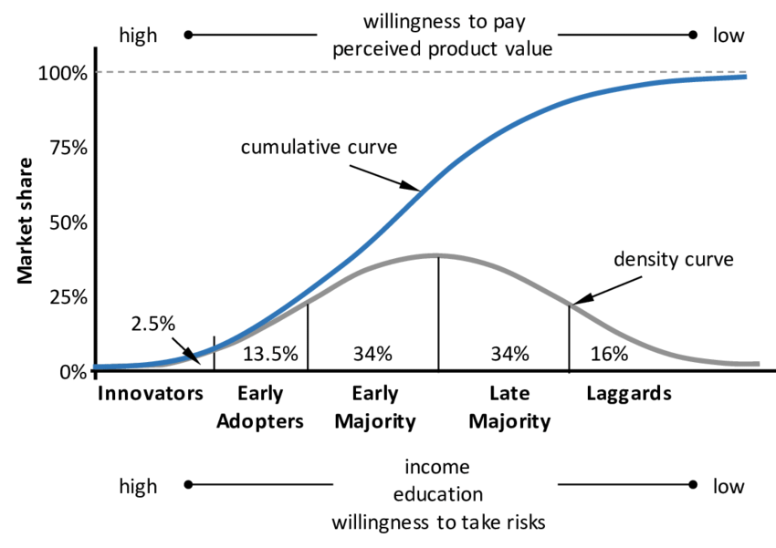
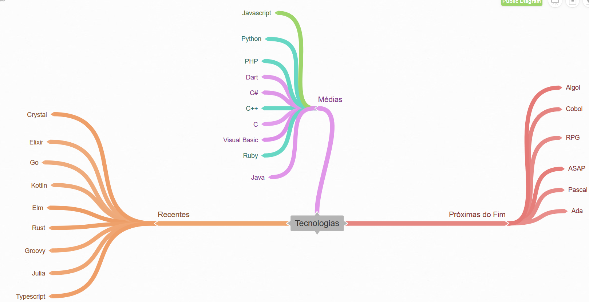

# Programador Apaixonado

Comecei a leitura [deste livro](https://www.casadocodigo.com.br/products/livro-programador-apaixonado) e achei as ideias apresentadas muito interessantes. Apesar de o [Chad Fowler](http://chadfowler.com) ter feito a primeira publicação em 2009 diversos dos assuntos abordados são extremamente atuais e trazem um ótimo ensinamento para programadores que buscam construir uma carreira de qualidade. Irei resumir e interpretar o livro neste post, juntamente com respostas aos exercícios que forem aplicáveis.

## Liderar ou Sangrar

Sempre existe a dúvida de qual tecnologia escolher, ir entre as opções estáveis e bem estabelecidas no mercado ou apostar em tecnologias novas? Você cairá no clássico trade-off risco-recompensa.

Escolher algo estável no mercado será uma opção mais segura, porém a concorrência será maior, todos querem algo mais "tranquilo". Você pode facilmente encontrar trabalho mas não será algo tão lucrativo. Baixo risco. Baixa recompensa.

Em contra partida, escolher uma tecnologia nova é uma aposta, você pode iniciar os estudos em uma tecnologia que será lider de mercado em alguns anos ou investir seu tempo em algo que ficará "morto". Investir em uma tecnologia nova logo de inicio fará de você um líder em uma grande e influente tecnologia. Se o seu estudo da tecnologia escolhida for correto e ela decolar você será um profissional único entre poucos disponíveis. Alto risco. Alta recompensa.

Contradizendo o gráfico acima, ainda existe uma posição no mercado chamada de "asilo da tecnologia" onde alguém deve migrar um sistema legado para uma nova tecnologia, assim este antigo sistema pode morrer em paz. O profissional responsável por esta migração com certeza será bem pago, pois a maioria dos profissionais que conhecem uma tecnologia antiga já migraram para novas ou se aposentaram. Mas ainda assim é arriscado, pois você será especialista em uma tecnologia que não existe.

Assim as duas pontas da curva de adoção se provam lucrativas.

Se quiser uma ajuda para analisar as tecnologias com promessas e as que estão "morrendo" acesse [este post](https://www.infoq.com/articles/programming-language-trends-2019/)

**Exercício** ✔️
Faça uma lista de tecnologias recentes, médias e antigas baseada no mercado atual. Mapeie-as em uma folha da esquerda para a direita. Na esquerda, coloque as tecnologias recentes, e na direita, as que estão próximas do fim. Force a si mesmo para encontrar a maior quantidade possível de tecnologias. Seja o mais granular possível sobre onde as tecnologias estão quando comparadas umas com as outras.

Quando você tiver mapeado o máximo de tecnologias que conseguiu se lembrar, marque as tecnologias nas quais você se considera forte. Então, talvez em uma cor diferente, marque aquelas sobre as quais você possui algum conhecimento, mas não domina. Onde está a maioria das tecnologias que você marcou? Elas estão aglomeradas em alguma ponta? Estão espalhadas? Elas estão próximas às pontas em que você se interessa?

Meu mapa:

Verde: Domino a linguagem
Turquesa: Conheço e sei, mas sem dominio e sem uso no dia-a-dia.

Criei o mapa com base em pesquisas de gráficos e de "cabeça"

Analisando este gráfico vejo que a minha média está no meio, onde é uma zona de segurança, pois muitas empresas utilizam e o mercado é tranquilo. Meu interesse é em apostas altas, terei que iniciar um estudo em tecnologias mais novas e em ascensão.

Tendências de linguagens de programação em 2019:

## Oferta e Demanda

O grande equilibrio do mercado, se existem muitas pessoas querendo e poucas oferecendo o serviço, o preço é alto. Em oposto, se existem muitas pessoas oferecendo o serviço e pouca demanda, o preço é baixo.

Veja por exemplo a criação de um site em HTML, se você estava vendendo sites simples em 1991 com certeza conseguia um valor bem alto para uma simples página em HTML. Mas hoje, e 2020 o HTML puro é tão simples que vale quase nada, pode ser feito realmente de graça por construtores online. Afinal de contas muitas pessoas viram que um site em HTML podia render uma quantia considerável, assim muitos quiseram entrar nesse mercado, aumentou a quantidade de oferta e o preço caiu. Com o tempo profissionais que eram especiailista e dominavam HTML perderam seu valor no mercado, tendo que migrar para outras tecnologias, agregar seu conhecimento ou tentar competir no preço.

> Competir no preço sempre será difícil

Quando a maioria de nós pensa em oferta e demanda, achamos que tem a ver com o preço com que algo pode e será vendido. Se houver mais de um item à venda do que o número de pessoas querendo comprar aquele produto, então seu preço vai diminuir. Se houver mais pessoas querendo comprar o produto do que a quantidade de produtos disponíveis, o preço irá aumentar, de forma que os compradores concorram entre si.

E assim normalmente haverão mais compradores de um produto barato do que um mais caro.

Esse conceito é importante no desenvolvimento de software pois você pode estar em um ponto onde sua tecnologia de especialidade está sendo migrada para offshores, que são empresas aberta em locais onde a mão de obra é mais barata.

Empresas nesse estilo trabalham com tecnologias baratas e onde existe uma grande quantidade de mercado, injetando centenas de programadores a um custo muito baixo no mercado. Tecnologias de alto risco como visto no bloco anterior raramente são adotadas por empresas de offshore por serem arriscadas para eles.

Então durante a escolha de tecnologia é bom entender sobre esses assuntos, algumas tecnologias sempre estarão saturadas no mercado e terão uma curva de ascensão de lucro demorada.

Caso você seja um desenvolvedor Java ou PHP com certeza encontrará uma concorrência muito mais alta se comparado a um programador Python ou Rust. Porém se o mercado de Rust estivesse ganhando visibilidade e retornos mais altos as pessoas iriam se interessar por essa linguagem e oferecer seus serviços por um preço similar, o que resulta em concorrência, o que volta aos preços baixos e interesse das offshore.

A maior lição é: com aumento de demanda, vem o aumento da concorrência e consequentemente a baixa de preços. Se quiser um lucro maior busque mercados onde as offshores ainda não atuam, é arriscado, mas você precisa ser habilidoso e atento para se mover.

> Explore mercados não balanceados

Mercados que já estão balanceados possuem a demanda coberta, então serão menos "vorazes".

**Exercício**
Pesquise as habilidades que estão sendo requisitadas no mercado. Use sites de vagas e repositórios de empresas para encontrar as tecnologias e habilidades que estão em alta/baixa demanda.

Pesquise tecnologias que as empresas de offshore utilizam e compare com as tecnologias da sua pesquisa de mercado. Compare as tecnologias que você identificou uma boa demanda, porém as empresas de offshore não usam.

Quanto tempo levará para as empresas offshore oferecem serviços com essa tecnologia? Essa diferença é um mercado desbalanceado.

## Escrever código não é suficiente

Vá além do código, busque entender sobre a área do negócio que você atua. Dominar e entender as necessidades do projeto ou empresa que você está trabalhando será um grande diferencial.

Ao invés de simplesmente completar listas de tarefas, você pensará e terá base opinativa nas novas implementações com uma visão menos técnica e mais empreendedora.

Se esforce para expandir seu conhecimento de negócios e tente entender uma gama alta de negócios diferentes, esse ponto será um diferencial em sua carreira.

**Exercício** ⚔️
Regularmente converse com algum empresário e pergunte como funciona o negócio dele, como eles trabalham, quais são as dificuldade ou facilidades tecnológicas que possuem. Com essas informações de forma recorrente seu repertório e entendimento de negócios será expandido e você terá mais argumentos e bases para conversar com clientes.

## Seja o pior

Buscando ser "o pior" do ambiente em que você vive induzirá você a se adequar ao melhores do grupo, como uma osmose. Você precisa buscar sempre conviver seja pessoalmente ou online com pessoas que são melhores que você em algum aspecto.

> Seja o pior em qualquer grupo em que estiver

Por mais estranho que pareça você ficará mais inteligente e com códigos mais elegantes. Sendo o pior voluntariamente removerá o medo de errar e fará você

> As pessoas ao seu redor afetam a sua performance. Escolha bem seu grupo.

**Exercício**

Encontre uma situação para você ser o pior. Caso você não possa se dar ao luxo de mudar de empresa ou buscar equipes externas encontre um projeto para trabalhar como voluntário em que você possa trabalhar com desenvolvedores melhores que você, eles irão torná-lo melhor por osmose.

Ache uma comunidade, projeto open-source, meetup, desafio e participe ativamente.

## Invista em sua inteligência

Force-se a inserir você mesmo em ambientes hostis e mais exóticos quando estiver estudando ou programando por diversão, isso criará uma "armadura" concreta e um conhecimento além do comum. Dessa maneira você será um destaque em meio a tantos que buscam apenas comum e simples. Ame aprender coisas novas, busque diversidade.

Se você estiver interessado todos saberão que você aprende as coisas por autodesenvolvimento e melhor ainda por pura diversão, você mostrará ânimo e motivação perante sua profissão.

> Não lhe deram a oportunidade...? Faça a oportunidade!

Essa exposição voluntária a ambientes não tradicionasis lhe trará profundidade, conhecimento e criatividade.

**Exercício**
Aprenda uma linguagem de programação nova. Mas não mude para algo muito similar ao que você sabe hoje, busque uma linguagem que o faça pensar de forma diferente. Não precisa se tornar um especialista, apenas faça código para que você sinta a diferença da linguagem.

Peça para desenvolvedores mais experientes reverem seu código e fazerem sugestões.

## Não escute seus pais

Normalmente conselhos dados por pessoas próximas serão induzidos pelo medo e tendem a ideia de não perder. Mas o foco aqui é ganhar o máximo, mesmo correndo riscos. Pensar em não perder não é o caminho para ganhar! Ganhadores assumem riscos. Pense sobre onde você quer ir ao invés de onde as coisas estão. Planejamento de carreira baseado em medo o levará para um ponto que quase com certeza não será satisfatório. Seguro, mas não divertido.

Outra questão referente a carreira que está indo de encontro com o tradicional é a mudança de emprego frequente, porém na área de TI isso pode ser preferível. Como profissional de software o máximo de conhecimento e experiência em diversas áreas fará com que você amplie seu conhecimento e percepção em como construir programas.

Assuma riscos em sua carreira. Não deixe o medo o consumir. E se você não estiver se divertindo, você não vai ser excelente.

**Exercício** ✔️
Quais são os seus maiores medos com relação à sua carreira? Pense sobre as últimas decisões que você tomou. Faça uma lista de escolhas que fez e pense o quanto dessas decisões foram conduzidas pelo medo? Como você poderia reverter e tomar uma decisão com menos medo?

_R:_ Creio que uma das preocupações é em relação ao tempo, parece que não vai dar tempo de aprender tudo que quero. Mas sei que esta é uma ansiedade sem base pois a maestria de algo vem com a pratica deliberada, algo que me ajudou muito nessa questão foram os videos do Fabio Akita explorando a dimensão do tempo.

Poucas das minhas escolhas são tomadas com medo, existe uma incerteza por fatos externos que não podem ser controlados por mim, mas esse é um fator comum. As escolhas dos últimos anos é o foco em ser excelente, então venho melhorando pouco a pouco para alcançar o que busco.

## Seja generalista

O mundo de software é composto por mudanças rápidas, ágeis e flexiveis, então você também precisa se adaptar.

Para se tornar a pessoa que será lembrada você precisa ser capaz de resolver problemas. E quais são esses problemas? Exatamente, você não sabe. Nem ninguém.

Normalmente generalista são rotulados como pessoas que sabem de tudo mas não entendem de nada, visto como algo ruim. Mas quando você tiver um problema que precisa de solução rápida alguém que conhece de tudo um pouco pode ser muito mais eficiente, essa pessoa poderá resolver o erro, subir o servidor e ainda verificar o banco de dados para ver se está funcionando. O generalista pode tomar decisões de arquitetura, design e implementar a correção para o servido em produção rapidamente. Neste cenário a ideia de especialista parece bem antiquada.

Se você é apenas um "programador", ou um testador, ou um designer, você vai se encontrar ocioso ou fazendo trabalho pesado e sem importância. Se você é "apenas" um programador .NET você não vai ter muito a contribuir quando o foco de um projeto ou empresa mudar, mesmo que temporariamente, da sua área de foco. É sobre o quão útil você é.

> Generalistas são raros...e por isso, preciosos.

O caminho para se tornar generalista é não se rotular, seja flexível.

No mundo atual de evolução rápida um lider técnico que pode gerir pessoas mas também pode resolver um bug crítico de última hora terá muito mais valor. Tente evitar ser o programador bitolado que só fala com máquinas, as vezes é bom entender do negócio ou liderar, pode ser necessário. Profissionais que saem do comum são raros.

> Suas habilidades transcedem tecnologia.

Outro exemplo é em relação a plataforma, ser um amante do UNIX que se recusa a trabalhar no Windows é inviável. Seja neutro em relação as suas escolhas, todos temos preferências, mas em alguns momento devemos deixá-las de lado. Domine uma tecnologia e fique bom em outra. Suas habilidades devem transceder tecnologia ou plataforma. Lembre-se que são apenas ferramentas.

**Exercício**
Liste as dimensões em que você pode ou não estar generalizando seus conhecimentos e habilidades. Para cada dimensão escreva sua especialidade.

Assim que possível comece a aprender alguma tecnologia que você listou. Se possível pratique e aplique.

_Lista_
Linguagem de programação/JavaScript => Rust 🌱
Paradigma/Imperativo => Reativo, Procedural, funcional 🌱
Economia/Criptomoedas/ações => Commodities 🌱
Vendas e comunicação 🌱
Marketing de comunicação e conteúdo 🌱

## Seja especialista

Evite a falta de profundidade técnica.

> Muitos acreditam que ser especialista em algo significa que você não sabe outras coisas.

Ser especialista não é saber apenas uma coisa e desconhecer as outras. Seguindo essa lógica minha mãe seria especialista em Windows porque nunca usou Linux.

Infelizmente na área de software existem muitos especialistas rasos que usam o termo apenas como desculpa para saber só uma coisa. Especialista deve ser alguém com um profundo conhecimento técnico em uma área específica.

Seja um especialista que saiba resolver qualquer problema de implatação em sua linguagem ou que ao menos saiba a quem pedir ajuda se necessário.

Este é o tipo de especialista que a indústria precisa. Se você é um especialista em Ruby, isso não é uma desculpa para não saber nada além de Ruby. Isso significa, que se for relacionado a Ruby você é o cara. Clientes com problemas no servidor e ninguém sabe o porque? "Dê 30 minutos".

Espero que isso seja o que você considera um especialista, antes de rotular algum.

**Exercício** ✔️
Independente da sua linguagem como é que o código que você digitou passa de texto legível para as instruções que um computador executa? O que significa escrever seu próprio compilador? Quando você importa ou usa bibliotecas, de onde elas vêm? Como um compilador, sistema operacional ou máquina virtual liga vários pedaços de código para formar um sistema coerente? Aprender esses pontos fará com que você fique muito mais próximo de ser um especialista em sua linguagem.

Encontre uma oportunidade e dê uma aula sobre algum tema da tecnologia que você gostaria de se aprofundar. O ensino é uma das melhores maneiras de aprender.

_R:_
Coincidentemente as perguntas aqui casam com as aulas da [CS50](../../cs50)
1 - O computador executa apenas binário, então sempre haverá algum interpretador para "transformar" todo o texto legível em binário. O process desta transformação pode variar de acordo com cada linguagem. CÓDIGO -> INTERPRETADOR -> BINÁRIO (0010)
2 - Teoricamente você mesmo construirá o processo até se comunicar diretamente com o Hardware.
3 - Depende, normalmente vem de gerenciadores de bibliotecas (npm, yarn, github, gem...). Bibliotecas são códigos que alguma pessoa escreveu e você acopla em seu código. Tudo que estiver nessa biblioteca também fará parte de seu programa, por isso é bom prestar atenção em quais bibliotecas está utilizando.

Vou ensinar o [CS50](https://cs50.harvard.edu/x/2020/) como forma de revisão.

## Não coloque todos seus ovos em um só cesto

Cuidado ao construir sua carreira em volta de uma tecnologia específica, criada por uma empresa específica, da qual você não é empregado. E se a empresa acabar? E se sua tecnologia se tornar obsoleta? Porque você vai confiar sua carreira para um terceiro?

> Uma visão centrada apenas no fornecedor é uma visão míope

Evite tecnologias em que os detalhes de implementação são um segredo do fornecedor. Isso criará uma barreira entre você e a solução que é criada por um terceiro.

Por mais que o investimento em uma única tecnologia seja uma má ideia, se você quiser fazer isso, considere buscar uma opção open source, estude os detalhes de implementação. Quando você entender os detalhes a fundo verá que pode fazer muitas coisas por conta. Sua visão irá aumentar e a sua mente abrirá. Comece a entender os padrões e como tudo funciona. "Não importa o fornecedor, eu sei como criar um sistema!".

**Exercício**
Tente um projeto pequeno duas vezes. Uma em sua tecnologia padrão e outra na tecnologia concorrente.

## Ame-o ou deixe-o

Parece uma ideia manjada de livro barato, mas é um conceito importante. Se você quer ser excelente em seu trabalho, você tem que ser apaixonado por ele. Se você não dá a mínima para o que faz isso irá transparecer.

> Existem muitos para receber salários e poucos artistas apaixonados

Todos podemos dar um grande passo longe da mediocridade encontrando um trabalho pelo qual somos apaixonados.

**Exercício**
Vá encontrar um emprego que você é apaixonado

Mantenha um registro simples avaliando seu nível de empolgação de 1 a 10.1 significa que você preferia estar doente do que ir ao trabalho e 10 que você não consegue ficar na cama pois precisa finalizar sua próxima tarefa. Depois de duas semanas analise os resultados. Foi tudo baixo ou alto?

Para as próximas semanas toda manhã planeje como você fará o dia ser um 10. Cada dia registre o nivel de empolgação do dia anterior. Se ainda continuar com médias baixas talvez seja hora de pensar em mudança.

## Aprenda a pescar

Educação exige um professor e um estudante. Muitos de nós somos muitas vezes relutantes em ser um estudante.

> Não espere que lhe digam. Pergunte!

Evite ficar à merce de outras pessoas, seja independente ao máximo que conseguir. Por mais tenham outros profissionais em sua equipe, tente entender o que eles fazem e porque a função deles está interligada com a sua.

Comece a aprender as ferramentas de seu mercado. Tudo que faz parte de seu processo de desenvolvimento precisa ser entendido, nem que seja o mínimo. Evite ficar com "coisas mágicas" que funcionam e você nem sabe como ou porque. Entenda o mínimo para conseguir se virar, e o que tiver dúvidas e precisar, pergunte.

Aprenda pelo menos o básico de uma área que não é sua responsabilidade e já será um diferencial.

Vá aprender por conta!

**Exercício**
Como e porque? Sempre que estiver trabalhando ou estudando pense sobre as partes que você não entende por completo: como isso funciona? E por que isso tem que acontecer?

Você pode não saber responder, mas o simples fato de se questionar já o colocará em outro patamar.

Continue perguntando sobre como e porque até que tenha ido longe o suficiente.

Escolha uma das mais críticas porém negligenciadas ferramentas de seu ambiente e foque nela. Reserve um pequeno periodo de tempo todos os dias para aprender uma coisa nova sobre ela que vai lhe dar mais controle. Em momentos que a mente divaga ao invés de ir para o Facebook ou Twitter, você pode buscar por dicas de bash. Rapidamente você encontrará alguma coisa que não sabia e pode usar o truque do como e porque.

## Aprenda como os negócios realmente funcionam

Não subestime o conhecimento de domínios, certifique-se de investir o seu entendimento além da programação em outros assuntos. Obrigatoriamente saiba o básico de finanças, todos os negócios dependem de finanças.

> Você não pode criativamente ajudar em negócios sem saber como ele funciona

Entender como um negócio funciona lhe dará o "poder" da criatividade, entendendo os pontos que são essenciais farão com que você pense e programe funcionalidades melhores para toda a empresa. Para poder programar algo útil você precisa entender o problema e os porquês.

Conhecendo a empresa e o ramo de atuação você terá a capacidade de fazer mudanças significativas ao invés de coisas que são aparentemente corretas.

**Exercício** ✔️

1. Procure um livro básico sobre negócios, e trabalhe com ele.
2. Peça para alguém orientá-lo na área de finanças de sua empresa e explicar como funcionam as coisas.

_R:_ Já faço isso, como atuo em minha própria empresa entender de negócios e finanças é obrigatório, além de que utilizo este mesmo conhecimento para a vida pessoal fazendo controle de finanças e investimentos. Concordo com o autor do livro que este é um conhecimento descartado pela maioria e que o entendimento de negócios e economia em um geral pode lhe dar uma vantagem em diversos aspectos, sua visão vai além.

## Encontre um mentor

> É OK depender de alguém. Só tenha certeza que é a pessoa certa

Normalmente na área de TI a prática de mentoria é algo raro e visto como um ponto de fraqueza. Por mais que seja benéfico para todos.

Procure um mentor que seja um modelo a seguir.

Você precisa de novos níveis comparativos para ver que não é "tão bom" quanto você pensa e para que possa ter uma nova noção de realidade, assim você pode buscar um novo ponto de melhoria.

**Exercício**

1. Tutorie a si mesmo – todos nós queremos ter alguém para nos orientar, mas a realidade é que nem sempre vamos poder encontrar alguém a quem possamos dar esse papel. Eis um jeito de fazer uma automentoria.

Pense na pessoa de sua área que você mais admira. Muitos de nós já possuem uma pequena lista pronta, pegando de algum momento de nossas carreiras. Pode ser alguém com quem tenha trabalhado, ou pode ser alguém cujo trabalho é admirado. Liste os dez atributos mais importantes desse modelo a seguir. Escolha os atributos que são a razão de você tê-lo escolhido para esse papel. Tais atributos podem ser de áreas específicas de habilidade, como amplitude de tecnologia, ou a profundidade de conhecimento sobre algum domínio. Ou, eles podem ter características mais pessoais, como a habilidade de deixar os membros da equipe tranquilos, ou a de ser um palestrante envolvente.

Agora, ranqueie essas qualidades em ordem de importância, sendo que 1 é o menos importante e 10, o mais importante. Você acabou de criar e destilar uma lista de atributos que você acha admiráveis e importantes. Esses são os caminhos nos quais você deve se empenhar para emular o modelo escolhido. Mas como escolher em qual focar primeiro?

Adicione uma coluna à lista, e para cada item na lista, imagine como seu modelo iria avaliar você em uma escala de 1 a 10 (10 sendo o melhor). Tente realmente se colocar na mente de seu modelo e observar a si mesmo como se fosse uma terceira pessoa.

Quando você tem os atributos, o ranking, e suas próprias avaliações, em uma coluna final, subtraia sua classificação em cada fileira do nível de importância que você deu à coluna anterior. Se você ranqueou algo como 10 para o atributo mais importante de seu modelo, e sua própria avaliação foi 3, isso lhe dá uma prioridade final de valor 7. Tendo preenchido esta coluna completamente, separando em ordem descendente, você terá uma lista das 10 áreas priorizadas em que você deve melhorar.

Comece com os primeiros dois ou três itens, e formule uma lista de tarefas concretas que você pode começar a fazer agora para melhorar a si mesmo.

## Seja um mentor

Se você quer realmente aprender alguma coisa, tente ensiná-la para outra pessoa. (Learn in Public)

> Para descobrir se você realmente sabe algo, tente ensinar para outra pessoa

Quando ensinamos alguém nós limpamos os cantos sujos de nosso conhecimento que raramente são expostos.

Você não precisa ser um especialista para ensinar, com certeza existe algo que você sabe/entende que pode de fato ajudar alguém com dificuldades. Encontre esse algo e comece a ser prestativo.

Apenas comece a ajudar as pessoas.

**Exercício**
1 - Encontre alguém para ajudar. Ofereça-se como voluntário para facilitar o caminho dessa pessoa.

2 - Encontre um fórum/servidor online e comece a ajudar respondendo dúvidas.Torne-se conhecido pela sua habilidade e paciência em ajudar as pessoas

## Pratique, pratique, pratique

Quando você pratica/estuda programação deve ser difícil, não deve ser algo simples. Se seus códigos estão sempre impecáveis e sem dificuldade alguma no processo quer dizer que você não está estendendo seus limites. A prática serve para isso.

Pratique e erre nos bastidores para que possa atuar excelentemente em público.

Você consegue imaginar um músico subindo no palco sem ensaiar?

Invista tempo em sua profissão!

> Pratique nos seus limites

Você deve reservar um momento para praticar. É sua responsabilidade.

**Exercício**

TopCoder: Site para competir

Code Kata: Site para praticar código

## O jeito que você faz

Normalmente metodologias são tratadas com um certo preconceito e impostas através de uma hierarquia, isso faz com que toda uma área de conhecimento seja negligenciada. Para de aceitar processos ineficientes e jargões desnecessários, se você pensa que deve existir uma maneira melhor de desenvolver software, talvez exista mesmo. Se aprofunde e mude.

Para um processo funcionar ele precisa ser compreendido por todas as pessoas que irão utilizá-lo.

**Exercício**

1 - Escolha uma metodologia de desenvolvimento de software, e escolha um livro, comece a ler sites e inscreva-se em uma lista de e-mails. Analise a metodologia e aponte o que acha positivo e negativo.

## Nos ombros dos gigantes

Estudar a obra os mestres é uma parte essencial para se tornar um mestre

> Minere códigos existentes para ter insights

> Use códigos existentes para refletir sobre suas próprias capacidades

Leia códigos de desenvolvedores excelentes para se situar e ver em qual nível você se encontra, pode ser humilhante, mas com certeza trará um grande benefício com ideias e código que você jamais teria imaginado.

Se aproveite do mundo open source para entender e se aprofundar em softwares por completo.

**Exercicio**
1 - Escolha um projeto e o leia como um livro. Faça anotações. Esboce as coisas boas e ruins. Escreva uma crítica e publique

2 - Encontre um grupo de pessoas que pense como você e se reuna para estudar códigos de 2 a 200 linhas. Quebre o código e discuta o que está sendo utilizado.

## Automatize-se em um emprego

Pare de tentar competir em quantidade de programadores offshore.

Automatize processos para que você possa ter um fluxo de trabalho melhorado e possa comprovar a eficácia de um programador excelente. Pense em automatizar o fluxo da empresa e negócio.

> Não importa o qual nova ou legal uma tecnologia seja, ela só terá valor se resolver um problema real

**Exercício**
1 - Escolha uma tarefa que você faz de forma repetitiva e escreva um gerador de código para ela. Não se preocupe com reusabilidade. Apenas garanta que seu gerador economize tempo. Pense em uma maneira de aumentar o nivel de abstração do que você está gerando.
2 - Pesquise por model-driven architecture (MDA). Experimente algumas das ferramentas disponíveis. Procure alguma lugar do seu trabalho no qual aplicar alguns conceitos MDA, ou talvez o grupo completo de ferramentas. Pense em aplicar os conceitos de MDA apenas com as ferramentas que você utiliza todo dia.

## Agora Mesmo

O trabalho irá se expandir pelo tempo disponível para a conclusão.

Um senso de urgência mesmo que fictício é o suficiente para facilmente dobrar ou triplicar sua produtividade.

Trate seus projetos como corrida e você chegará ao final muito mais rápido do que se você tratá-los como uma cela de prisão. Crie movimento. Seja aquele que empurra, não fique confortável demais.

**Exercício**
Olhe para sua escrivaninha. Examine as tarefas que estão lá por um longo tempo, os projetos que estão começando a tomar forma, ou aqueles em que você está um pouco travado -- talvez por questões burotcráticas, talvez travados por conta de alguma análise.
Encontre um que você poderia fazer nas horas livres do seu trabalho normal, quando você estaria provavelmente navegando pela internet, checando e-mails ou tendo um almoço por mais de uma hora. Transforme um projeto de meses em uma tarefa de menos de uma semana

## Leitor de mentes

Preste atenção nos detalhes e conversas. Implemente funcionalidades que são frequentemente comentadas. Se forem baratas e rápidas faça-as antes de serem solicitadas.

> O truque da leitura de mente, se feito certo, faz as pessoas dependerem de você.

Se você conseguir identificar funcionalidades que seus clientes querem mas ainda não pediram e desenvolver, você irá encantá-los.

Cuidado com os riscos da leitura de mentes:
Comece pequeno, faça suposições de itens que podem ser encaixados nas frestas de seu trabalho normal, sem muito custo para a empresa.

Evite este truque caso a mudança altere o caminho arquitetônico do sistema ou limite de alguma forma o que ele pode fazer.

**Exercicio**
Comece a tomar nota de funcionalidades que você acha que os usuários e gestores irão pedir. Seja criativo. Tente ver o sistema a partir do ponto de vista deles. Depois de ter uma lista de funcionalidades não tão obvias, pense sobre como você poderia implementá-las de forma mais eficiente. Pense sobre os casos limites que seus clientes podem não ter em mente imediatamente.

Conforme você recebe solicitações de melhoria, acompanhe sua taxa de acerto. Quantas das suas suposições tornaram-se funcionalidades que realmente foram requisitadas? Quando suas suposições vieram à tona, você foi capaz de usar as ideias que vieram em sua sessão de brainstorm?

## Êxito diário
Melhore sua habilidade de expor quando excede as expectativas

> Tenha uma realização para relatar todo dia

Acompanhar seus êxitos com frequência irá assegurar que você não fique travado: se você deve alcançar um êxito por dia, não pode ficar elaborando a tarefa perfeita durante duas semanas.

**Exercício**
Separe meia hora e sente-se em um local calmo para pensar sobre os pequenos problemas diários de sua equipe. Anote-os. O que gasta tempo de sua equipe diariamente e que poderia ser melhorado?

O que vocês estão fazendo manualmente que poderia ser feito de forma automática? Há algo que você pode limpar? Pode fazer redução de falhas?

Reserve 20 minutos e escreva todas as ideais boas e ruins, separe cinco itens mais irritantes e faça 1 por dia durante a semana.

## Lembre-se de para quem você trabalha
Resolva e busque fazer parte de problemas que estão próximos a você, caso a hierarquia de sua empresa seja muito profunda. Fazendo uma pequena parte você contribui para impactar diversos níveis da empresa.

> O sucesso de seu chege é o seu sucesso

Alinhe-se com as necessidades do negócio e alinhe o negócio com suas necessidades. Se for dominar a sua função isso irá assegurá-lo de fazer as coisas certas

**Exercicio**
Faça uma reunião com sua equipe e entenda as metas e objetivos a serem alcançados. Pergunte como você pode fazer a diferença. Priorize o trabalho com base nessas metas.

## Esteja onde você está

Pare de pensar e agir com base na sua próxima promoção, faça a sa função atual de forma excelente e o próximo degrau da escada será automático.

> Seja ambicioso, mas não demonstre

Foque-se e invista no seu presente, por mais que o futuro seja importante. A sua dedicação no presente será refletida no futuro sem ao menos você perceber.

**Exercício**
Coloqueas metas de sua carreira de lado por uma semana. Escreva seus objetivos para seu emprego atual. Em vez de pensar sobre aonde você quer ir em seguida, pense sobre o que você quer ter alcançado quando você terminar o trabalho no qual está agora. O que você pode ter produzido nesse emprego que terá sido ótimo? Crie um plano que seja ambos estratégico e tático. Passe a semna implementando essas táticas em apoio às metas a longo prazo de "terminar" esse trabalho.

Quanto tempo vai passar até que você conquiste tudo o que sente que precisa em sua função atual? Como você saberá que terá concluído? Planeje a próxima semana e repita.